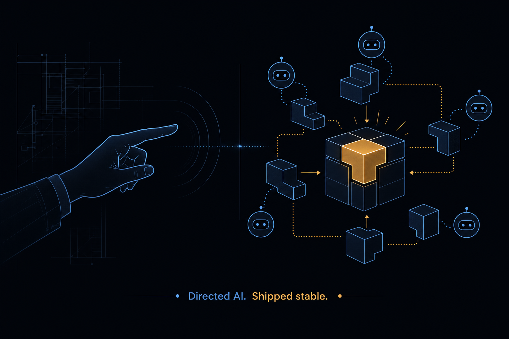
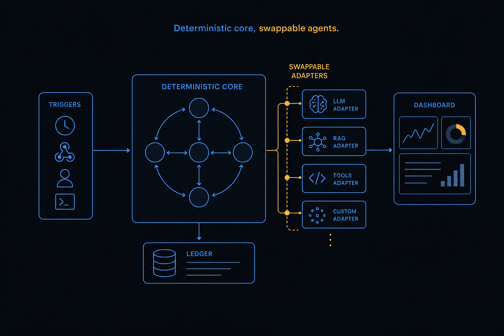

# repo_builder

**A fault-tolerant OTP platform that drives swappable AI agent CLIs through durable, crash-resumable workflows. Built typed, tested, and gate-green.**




> `repo_builder` does the **deterministic orchestration of non-deterministic AI agents**: humans, cron, and signed webhooks compose fixed-shape workflows (e.g. `plan → build → review → fix`) whose step order and branching are durable and survive a node restart, while the intelligent work inside each step is delegated to a **swappable, supervised external AI harness CLI** running as a child process.

**Contents:** [What it is](#what-it-is) · [Why it's hard](#why-its-hard-and-what-it-demonstrates) · [Architecture](#architecture) · [The green gate](#the-green-gate) · [How I built this](#how-i-built-this) · [Skills](#skills-demonstrated) · [Quickstart](#prerequisites) · [Status](#status-and-honest-limitations)

---

## What it is

It is an Elixir/Phoenix/OTP control plane for AI coding agents. You register a target repository, pick a workflow, and the platform runs each step by spawning a real agent CLI (Claude Code or `pi`) as a supervised OS process, normalizing its streaming output into one canonical event contract, and persisting every transition so a run can resume exactly where it left off after a crash. A live LiveView dashboard streams the logs, tool-calls, cost, and status as it happens.

The defining constraint is that the platform is **not locked to one harness**. Claude Code and `pi` ship today. Adding a third agent is one adapter module plus one config entry, proven by an included no-op Cursor adapter that needed zero edits to the core.

## Why it's hard, and what it demonstrates

The interesting engineering here is not CRUD. It is making non-deterministic, crash-prone external processes behave predictably under failure. Each problem below maps to a skill that travels:

- **Driving a streaming CLI child process safely** → an `erlexec`-backed GenServer per agent with partial-line and multibyte-safe NDJSON buffering, an idle-timeout watchdog, stdout-overflow backpressure, and an admission concurrency gate. *(OTP design under real OS-process failure.)*
- **Never leaking an OS process, even on a hard `SIGKILL` of the VM** → a durable `os_pid` ledger plus a boot-time reaper that verifies `/proc/<pid>/environ` against a per-session marker before it signals anything. *(Systems-level correctness, not hope.)*
- **One contract across many untrusted agents** → `RepoBuilder.Harness.Event`, a closed 8-variant `typedstruct` sum type with an **open** `harness :: atom()` identity and a raw escape hatch, normalized at a `TypeCheck` wire boundary. *(Type-driven design; defects caught at the boundary, not in prod.)*
- **Workflows that survive a node restart** → `workflow_runs` is the source of truth, persisted *before* each transition; live streaming stays in GenServers while durable steps run through Oban and a reconciler re-enqueues in-flight runs on boot. *(Durable state machines and the hot/durable split.)*
- **Secrets never reach disk** → events are redacted before persistence while the live broadcast keeps full detail. *(Security as a default, not an afterthought.)*
- **Extensibility without core edits** → an open-identity / closed-contract doctrine repeated across harnesses, the agentic-layer adaptor, and a full plugin system (add a harness *or* a plugin = one module). *(Designing seams that scale.)*

## Architecture



A deterministic core drives non-deterministic agents over a normalized event stream. Two execution paths share the same canonical contract: the **live path** (a `WorkflowEngine.Runner` state machine feeding the dashboard) and the **durable path** (Oban workers that persist each transition and reconcile in-flight runs after a restart). The full specification lives in [`BUILD_PROMPT.md`](BUILD_PROMPT.md); the engineering rationale in [`docs/engineering-principles.md`](docs/engineering-principles.md).

Module map:

- **Harness contract** (`lib/repo_builder/harness*`) — `RepoBuilder.Harness` mandatory `@behaviour` (`command/1` + `normalize/2`), optional `CustomSpawn`, the closed `Event` sum type, `Wire` (TypeCheck boundary), `Redact` (secret scrubbing), `Registry` (single source of truth + test seam), adapters (`Claude`, `Pi`, `Cursor`, `Fake`), and `Pricing`.
- **Session runtime** (`lib/repo_builder/session/*`) — the `erlexec` GenServer per child, `Admission` gate, `Session.Supervisor` (`:temporary` children).
- **Zero-orphan ledger** — `os_pid_ledger*` + `orphan_reaper.ex` (boot-time, marker-verified).
- **Persistence** (`lib/repo_builder/*`) — `binary_id` PKs, JSONB, `Ecto.Enum`, an embedded `Usage` value object with a float→Decimal nil-vs-0 cost boundary; the `@spec`'d context modules are the **only** `Repo` callers.
- **Workflow engine** (`lib/repo_builder/workflow_engine*`) — the deterministic state machine; `workflow_runs` is the source of truth.
- **Durable triggers** (`lib/repo_builder/workers/*`, `webhooks.ex`) — Oban `StepWorker` (unique on `{workflow_run_id, step_name}`), `CronTrigger`, `WorkflowResume`, and HMAC+timestamp-verified webhooks.
- **Web / observability** (`lib/repo_builder_web/*`) — `ConsoleLive` (the console at `/`), swimlane `DashboardLive`, `WorkflowLive` (`assign_async`), typed components, the webhook controller + raw-body plug, telemetry + alerting.

Two larger subsystems extend the core without touching it: the **agentic-layer adaptor** (point the platform at any target repo as a first-class `Project`) and a full **plugin system** (versioned packages contributing to a closed set of extension points). Both are documented below.

## The green gate

Every change has to pass a five-command gate before it lands. This is the bar that keeps the codebase stable:

```bash
mix compile --warnings-as-errors   # warnings are errors
mix format --check-formatted       # one canonical style
mix credo --strict                 # incl. @spec on every public function
mix test --warnings-as-errors      # 1,110 tests, all green
mix dialyzer                       # success-typing + contract checking
```

At this commit, the numbers behind that bar: **~31,000 lines of strictly-typed Elixir** across **155 modules** and **28 `@spec`'d contexts**. **1,110 tests**, driven entirely through a `Fake`/Mock adapter, so CI needs no external CLI. Dialyzer runs with a small set of justified, documented skips. The full gate also runs in CI (`.github/workflows/ci.yml`).

The typing is not cosmetic. There is a `@spec` on every public function, `typedstruct`/`@enforce_keys` for domain data, precise types over `any()`/`map()`, and `{:ok, t()} | {:error, reason()}` instead of raising. The standard is written down in [`ai_docs/typed-elixir-standard.md`](ai_docs/typed-elixir-standard.md) and enforced by `.credo.exs` and Dialyzer.

## How I built this

I built this with **Claude Code**, directing the work rather than typing every line. The method was deliberate, and it is part of what the project demonstrates.

The architecture and the invariants were mine: the supervision tree, the canonical event contract, the zero-orphan ledger, the durable-versus-live workflow split, the open-identity/closed-contract extensibility doctrine.

I broke the work into specs. The [`specs/`](specs/) directory holds 80+ plan documents that drove the build phase by phase, and a custom **ADW** (AI Developer Workflow) harness in [`adws/`](adws/) runs an agent through plan, build, test, and review against a target repo.

Nothing landed unless it was green. Every change had to pass the [green gate](#the-green-gate) first: warnings-as-errors, Credo `--strict`, Dialyzer, and the full test suite.

The hard parts I debugged myself. OTP races. An idle-timeout heuristic for agents that exit without a clean terminal marker. A test-sandbox teardown race. Dialyzer's view of macro-built TypeCheck types. AI moved fast, and the diagnosis and the calls were mine.

So the honest split is plain. I directed the design, the invariants, the review, and the debugging. AI accelerated the mechanical implementation, the test scaffolding, and the docs. The result is a strictly-typed, crash-isolated, gate-green codebase. The part worth noticing: this platform industrializes the same human-directs-AI loop I used to build it. Deterministic orchestration of non-deterministic agents, at two scales.

## Skills demonstrated

| Capability | Where in the repo | What it demonstrates |
|---|---|---|
| Concurrency & fault tolerance | supervision tree, `session/server.ex` | OTP design; crash isolation under real OS-process failure |
| Type-driven design | `ai_docs/typed-elixir-standard.md`, Dialyzer, Credo | discipline; defects caught at the boundary, not in prod |
| Systems / OS integration | `os_pid_ledger`, `orphan_reaper.ex`, `erlexec` | a zero-orphan guarantee that holds across hard crashes |
| Durable workflows | `workflow_engine/`, Oban, `workflow_runs` | crash-resumable state machines that survive node restart |
| Extensible architecture | harness registry, plugin system | open-identity/closed-contract seams (add a harness/plugin = one module) |
| Real-time UI | LiveView dashboard, streams, `assign_async` | flat-memory streaming observability |
| AI engineering | this whole repo + `adws/` + `specs/` | orchestrating AI agents to ship production-grade code |

---

## Prerequisites

The toolchain is **project-scoped** via [mise](https://mise.jdx.dev/): the `[tools]` are pinned in `mise.toml` at the repo root and are activated automatically when you enter the project directory. The pinned versions are:

| Tool | Version |
|------|---------|
| Erlang/OTP | `28.4` |
| Elixir | `1.20.1-otp-28` |
| PostgreSQL | `16.14` |

No Node.js version is pinned. PostgreSQL is provisioned as a user-space mise cluster (no `sudo`) via `scripts/pg.sh`, so the `postgres@16.14` tool above supplies the server binaries.

## Installation

PostgreSQL must be running **before** the database steps. The dev and test databases expect superuser `postgres` / password `postgres` on `localhost:5432` (trust auth via the project cluster).

1. **Install and activate the toolchain.** From the repo root, mise reads `mise.toml` and provisions the pinned Erlang, Elixir, and PostgreSQL:
   ```bash
   mise install
   ```

2. **Fetch dependencies:**
   ```bash
   mix deps.get
   ```

3. **Patch `type_check` (required before compiling).** `type_check 0.13.7` references a `Regex` struct field that does not exist on Elixir 1.20; this idempotent script removes the offending line so the project compiles under the pinned Elixir. It only edits the dependency's source — it does **not** compile anything — and must run **after** `mix deps.get` (or `mix deps.clean`) and **before** compilation:
   ```bash
   scripts/patch_deps.sh
   ```

4. **Compile** (recompile the patched `type_check` first, then the project):
   ```bash
   mix deps.compile type_check && mix compile
   ```

5. **Initialize and start the local PostgreSQL cluster** (one-time `init`, then `start`):
   ```bash
   scripts/pg.sh init
   scripts/pg.sh start
   ```

6. **Create, migrate, and seed the database.** The `ecto.setup` alias runs `ecto.create`, `ecto.migrate`, and `priv/repo/seeds.exs`:
   ```bash
   mix ecto.setup
   ```

### macOS notes

**PostgreSQL via Homebrew (recommended on Mac)**

The mise `postgres@16.14` tool fails to build on macOS ARM (missing ICU libraries). Use Homebrew instead:

```bash
brew install postgresql@16
brew services start postgresql@16
```

Remove `postgres = "16.14"` from `mise.toml` so mise doesn't try to build it:

```toml
[tools]
elixir = "1.20.1-otp-28"
erlang = "28.4"
# postgres line removed — managed by Homebrew
```

Then create the expected superuser role (Homebrew ships with no `postgres` role):

```bash
psql postgres -c "CREATE ROLE postgres WITH SUPERUSER LOGIN PASSWORD 'postgres';"
```

Skip `scripts/pg.sh` entirely — use `brew services start postgresql@16` instead of `scripts/pg.sh start`. The `mix ecto.*` commands connect to the brew-managed server directly.

**Activating mise in your shell**

After `mise install`, add activation to your shell profile so `mix`, `elixir`, and `iex` are on PATH:

```bash
echo 'eval "$(mise activate zsh)"' >> ~/.zshrc
source ~/.zshrc
```

**Corporate TLS / SSL inspection**

If `mix deps.get` fails with `Unknown CA` errors (common on corporate networks using SSL inspection), point Hex at your CA bundle:

```bash
export HEX_CACERTS_PATH="/path/to/your/combined-ca.pem"
mix deps.get
```

Add the export to `~/.zshrc` to make it permanent.

**`sed` compatibility (`scripts/patch_deps.sh`)**

macOS `sed` requires an explicit backup extension with `-i`. If you see `sed: -I or -i may not be used with stdin`, the script needs `sed -i ''` instead of `sed -i`. The repo version is already patched for this, but note it if you maintain a fork.

**Upgrading to the latest from GitHub**

Pulling a new revision can land new dependencies and new migrations, so a clean upgrade is more than `git pull`. On a Mac checkout the README/`mise.toml`/`scripts/patch_deps.sh` carry local setup tweaks (Homebrew Postgres, the `sed -i ''` fix); stash them first so the fast-forward stays clean, then restore:

```bash
# 1. Protect local setup tweaks and fast-forward to the remote tip
git stash push -m "mac-setup-tweaks"      # only if `git status` shows local edits
git fetch origin
git pull --ff-only origin dev
git stash pop                             # re-applies the tweaks (resolve README if it conflicts)

# 2. Re-sync deps, re-patch type_check, recompile
export HEX_CACERTS_PATH="/path/to/your/combined-ca.pem"   # only on corporate TLS networks
mix deps.get
scripts/patch_deps.sh
mix deps.compile type_check && mix compile

# 3. Apply any new migrations (Homebrew Postgres must be running)
brew services start postgresql@16         # no-op if already up
mix ecto.migrate

# 4. Verify the green gate before working
mix test --warnings-as-errors
```

If `git stash pop` reports a README conflict, it is because the remote also edited the README; resolve the markers, then `git add README.md`. Steps 2–3 are mandatory whenever a pull changes `mix.exs`/`mix.lock` or adds files under `priv/repo/migrations/`.

The `setup` alias chains `deps.get`, `ecto.setup`, `assets.setup`, and `assets.build`:

```bash
mix setup
```

> Note: `mix setup` does **not** run `scripts/patch_deps.sh`. On a fresh checkout, run steps 2–4 first (`mix deps.get` → `scripts/patch_deps.sh` → `mix deps.compile type_check && mix compile`) so `type_check` compiles, then `mix setup` is safe.

Database management aliases:

- `mix ecto.reset` — drop and re-run `ecto.setup`.
- `mix test` — runs `ecto.create --quiet`, `ecto.migrate --quiet`, then `test` (uses a `repo_builder_test<PARTITION>` database; `MIX_TEST_PARTITION` enables partitioning).

## Running the app

### Start

1. Start PostgreSQL (once per session):
   ```bash
   scripts/pg.sh start
   ```
2. Start the Phoenix server:
   ```bash
   mix phx.server
   ```
   Or inside IEx (recommended for driving sessions/workflows from the console): `iex -S mix phx.server`.

The app listens on **http://localhost:4000** by default (override with the `PORT` env var). The root route `/` is the orchestration console.

### Restart

- **Phoenix server:** stop it with `Ctrl+C` twice (or `:init.stop()` / `System.halt()` inside IEx), then re-run `mix phx.server`. There is no daemon to manage — the server runs in the foreground.
- **PostgreSQL** (e.g. after changing cluster config, or if a stale lock blocks startup):
  ```bash
  scripts/pg.sh restart
  ```
  Other cluster commands: `scripts/pg.sh stop`, `scripts/pg.sh status`, and `scripts/pg.sh psql` (open a `psql` shell). The cluster survives between sessions, so a `restart` is only needed when it is actually misbehaving — a plain `start` is the normal per-session step.
- **Full reset of app state** (drop, recreate, migrate, re-seed the dev database; keeps the cluster):
  ```bash
  mix ecto.reset
  ```

### Nuke PostgreSQL and start fresh

Use this when the cluster itself is corrupt or you want a truly clean slate (it deletes **all** databases and cluster state, not just the app's data). `scripts/pg.sh init` is a no-op once a cluster exists, so a real rebuild must delete the data directory first.

**Find the data directory first — don't assume `.pgdata/`.** The script resolves it as `PGDATA="${PGDATA:-$PROJECT_DIR/.pgdata}"`, and the mise `postgres` tool **exports `PGDATA`** when the toolchain is active (typically `~/.local/share/mise/installs/postgres/16.14/data`). So in the normal mise-activated shell the live cluster is at `$PGDATA`, and the project-local `.pgdata/` fallback is used only if `PGDATA` is unset. Always confirm before deleting:

```bash
scripts/pg.sh stop            # stop the server (no-op if already down)
echo "$PGDATA"                # the real cluster location (mise sets this); if blank, it's ./.pgdata
rm -rf "$PGDATA"              # delete the entire cluster (irreversible) — quote it
scripts/pg.sh init            # re-initialize a fresh cluster (postgres / trust auth)
scripts/pg.sh start           # start it
mix ecto.setup                # recreate + migrate + seed the dev database
```

> If `$PGDATA` is unset in your shell, substitute `./.pgdata` for `"$PGDATA"` above. Deleting the wrong path silently does nothing and leaves the old cluster intact (`init` will then report "cluster already initialized").

The test database is created on demand by `mix test` (`ecto.create --quiet`), so it needs no extra step after a nuke.

Routes:

| Method | Path | Target | Notes |
|--------|------|--------|-------|
| LIVE | `/` | `ConsoleLive` | Multi-layered orchestration console (create agents, launch sessions/ADWs, live event stream + swimlanes) |
| LIVE | `/dashboard` | `DashboardLive` | Swimlane dashboard |
| LIVE | `/agents/:id` | `AgentLive` | Single-agent view |
| LIVE | `/workflows/:id` | `WorkflowLive` | Workflow run (async cost/status) |
| LIVE | `/system-logs` | `SystemLogsLive` | System log stream |
| LIVE | `/projects` | `ProjectsLive` | Target-repo registry + per-repo dashboard (agentic-layer adaptor) |
| LIVE | `/plan` | `PlanningLive` | Planning-Mode Wizard → previewed, costed, launched ADW run |
| LIVE | `/plans/:id` | `PlanningLive :show` | A durable, shareable Plan artifact |
| LIVE | `/plugins` | `PluginsLive` | Plugin store / management (browse, install, activate per project) |
| POST | `/webhooks/trigger` | `WebhookController :trigger` | Signed workflow trigger |
| LIVE | `/dev/dashboard` | Phoenix LiveDashboard | **Dev only** (telemetry/metrics) |
| FORWARD | `/dev/mailbox` | `Plug.Swoosh.MailboxPreview` | **Dev only** |

The `/dev/*` routes exist only when `:dev_routes` is enabled (development).

## Agentic layer adaptor

The platform can be pointed at **any** target repository, not just itself. A target repo
is promoted to a first-class **Project** (`RepoBuilder.Projects`) carrying its identity,
auto-detected stack + capability map, a pinned command pack, a budget cap, and an
isolation mode. Everything else scopes to a project via a **nullable** `project_id`
(`nil` = "the platform itself", the back-compatible default).

- **Register a target repo** at `/projects`: paste its absolute path; the `Profiler`
  detects git metadata, the stack (`mix.exs`/`package.json`/`pyproject.toml`/`Cargo.toml`/
  `go.mod`), discovered `.claude/commands`/`AGENTS.md`/ADWs, and a capability map, then
  primes an orchestrator context block.
- **Stack-aware commands**: `RepoBuilder.Commands.Resolver` resolves each `/command` for a
  project through a precedence chain — repo-local `.claude/commands` → active plugins →
  pinned pack → stack pack → the `generic` base — filling capability tokens
  (`{{TEST_COMMAND}}` …) so one command body adapts to every stack. Versioned packs live in
  `priv/command_packs/`. See `ai_docs/agentic-layer-adaptor.md` for the authoring guide.
- **Worktree isolation** (opt-in per project, `isolation_mode: :worktree`): each run works
  in `git worktree add <scratch>/<run_id> -b adw/<run_id>` so parallel agents never collide
  and changes land on a reviewable branch. `:direct` (default) preserves today's behaviour.
- **Planning-Mode Wizard** at `/plan`: project → goal → workflow/harness/model/budget →
  stack-correct previewed steps + cost/context estimate → launch, persisting a durable
  Plan artifact (`/plans/:id`).

## Plugins

The platform is extensible by **plugins** — versioned packages that *contribute* to a
**closed set of extension points** with an **open string identity**, generalizing the
"add a harness = one module + one config entry" doctrine.

- **What a plugin contributes** (closed kinds): slash `command_pack`s, data-defined
  `workflow_type` ADWs, `agent_template`s, orchestrator `context_fragment`s,
  `capability` stack data, and — via an optional **code layer** — a `harness_adapter`.
- **Library → store → install → activate.** Author in the local folder library
  (`plugin_library/`), distribute through a store (a `LocalLibrary` source and a
  Req-backed `RemoteStore` ship today), install live into `agentic_plugins/`, and
  **activate per project**. Switching the orchestrator's bound project recomputes the
  effective set, so each repo gets exactly the behaviour its active plugins define.
- **Manage at `/plugins`** (browse, install/uninstall, activate/deactivate). Manifests
  are validated at a strict wire→domain boundary; installs are checksum/trust-gated.
  Code plugins run arbitrary BEAM code in-node and are never auto-installed without
  confirmation.

Adding a plugin is **one package, zero core change**; the bundled samples in
`plugin_library/` (a command pack, a workflow type, and a no-op code harness) prove it.
See `ai_docs/plugin-authoring.md` for the full authoring reference.

## Configuration

### Runtime environment variables (`config/runtime.exs`)

| Variable | Scope | Purpose |
|----------|-------|---------|
| `PORT` | all | HTTP port (default `4000`). |
| `PHX_SERVER` | release | Starts the endpoint when running a release. |
| `WEBHOOK_SECRET` | all | HMAC secret for webhook signature verification. When unset, signed triggers are rejected. |
| `SECRETS_KEY` | all | AES-256-GCM master key for the per-project secrets vault. Base64 of 32 random bytes (`openssl rand -base64 32`). Encrypts operator-deposited per-project secret values at rest; decrypted just-in-time into a worker's child env (never argv, never the orchestrator's LLM context, never persisted plaintext). Unset = the vault is disabled (fail-closed). |
| `ANTHROPIC_API_KEY` | all | Passed to the `claude` and `pi` harnesses. |
| `OPENAI_API_KEY` | all | Passed to the `pi` harness. |
| `FIRECRAWL_API_KEY` | all | One app-wide key for the firecrawl web-research MCP tool. Injected into the child env of workers the orchestrator grants `tools: ["firecrawl"]`; never persisted, never in argv. Requires `npx`/Node on PATH (`npx -y firecrawl-mcp`); the pi path also needs the operator's `pi-mcp-adapter` extension. |
| `DATABASE_URL` | prod | Production database URL (required; raises if missing). |
| `POOL_SIZE` | prod | DB connection pool size (default `10`). |
| `ECTO_IPV6` | prod | Use IPv6 for the DB socket when set to `true` or `1`. |
| `SECRET_KEY_BASE` | prod | Cookie/secret signing key (required; raises if missing). |
| `PHX_HOST` | prod | Endpoint host (default `example.com`). |
| `DNS_CLUSTER_QUERY` | prod | Optional DNS-based clustering query. |

### Harness registry (`config/config.exs`)

| Key | Adapter | Default model | Pricing |
|-----|---------|---------------|---------|
| `claude` | `RepoBuilder.Harness.Claude` | `claude-sonnet-4-6` | none (`%{}`) — cost reported in the stream |
| `pi` | `RepoBuilder.Harness.Pi` | `nil` | `%{"glm-4.6" => 0.6, "glm-4.5-air" => 0.2}` |
| `cursor` | `RepoBuilder.Harness.Cursor` | `nil` | none (`%{}`) — no-op extensibility proof |

### Session limits (`config/config.exs`)

`max_live_sessions: 100`, `max_children: 200`, `idle_ms: 300_000`, `max_line_bytes: 16_777_216`, `workspace_base: "priv/workspaces"`.

### Plugins (`config/config.exs`)

`install_dir: "agentic_plugins"`, `library_dir: "plugin_library"`, a `sources` map (`LocalLibrary` + `RemoteStore`), and a `trust` policy (`require_checksum`, `allow_code`, `require_signature`). The single reader is `RepoBuilder.Plugins.Registry`.

### Oban (`config/config.exs`)

- Queues: `default: 10`, `sessions: 20`, `workflows: 10`.
- Crontab: `{"*/5 * * * *", RepoBuilder.Workers.WorkflowResume}` (timezone `Etc/UTC`) — reconciles in-flight runs every 5 minutes.

### Alerting (`config/config.exs`)

- `cost_threshold_usd: 10.0`.

## Triggering a workflow

A workflow run can be started three ways:

1. **Interactively**, via the LiveView UI at `/dashboard` (and the per-workflow view at `/workflows/:id`).
2. **On a schedule**, via the Oban `CronTrigger` worker (the `*/5` crontab also drives `WorkflowResume`, which resumes in-flight runs from their `current_step` after a node restart).
3. **Via a signed webhook**, posted to `POST /webhooks/trigger`.

### Webhook signature scheme

The webhook is authenticated by a **hex-encoded HMAC-SHA256** over the string `"<timestamp>.<raw_body>"`, keyed by `WEBHOOK_SECRET`, plus a timestamp freshness window for replay protection. The signature is sent in the `x-signature` header and the Unix-seconds timestamp in `x-timestamp`. Verification is constant-time, and an invalid, unsigned, or expired request is rejected **before** any Oban job is enqueued (it never becomes a poison job). The raw request body bytes are signed, so the controller verifies against the cached raw body (via the `CacheBodyReader` plug). The JSON body selects the workflow by name with `workflow_name` (the workflow must already exist) and may carry `inputs`.

The signing reference (`RepoBuilder.Webhooks.sign/3`) is:

```elixir
:crypto.mac(:hmac, :sha256, secret, "#{timestamp}.#{raw_body}")
|> Base.encode16(case: :lower)
```

Example client:

```bash
SECRET="$WEBHOOK_SECRET"
TS=$(date +%s)
BODY='{"workflow_name":"my-adw","inputs":{}}'
SIG=$(printf '%s.%s' "$TS" "$BODY" | openssl dgst -sha256 -hmac "$SECRET" | awk '{print $2}')

curl -X POST http://localhost:4000/webhooks/trigger \
  -H "content-type: application/json" \
  -H "x-timestamp: $TS" \
  -H "x-signature: $SIG" \
  --data "$BODY"
```

## Testing & the green gate

The project enforces a five-command "green gate". Run each verbatim:

```bash
mix compile --warnings-as-errors
mix format --check-formatted
mix credo --strict
mix test --warnings-as-errors
mix dialyzer
```

The suite has **1,110 tests** and is driven against the runtime through the `Fake`/Mock adapter via the registry seam, so it needs no external CLIs. Dialyzer runs with a small set of **justified TypeCheck skips** (`.dialyzer_ignore.exs`). The full gate also runs in CI (`.github/workflows/ci.yml`).

## Adding a harness

Extensibility is by design: a new harness is **one module + one config entry**, with no edits to the canonical `Event` types, the `Agent` schema, or the runtime. This works because the `Event.harness` identity is an open `atom()`.

1. Implement `RepoBuilder.Harness` (mandatory `command/1` + `normalize/2`; optional `CustomSpawn`).
2. Register it under `:harnesses` in `config/config.exs` with its adapter module, default model, and price table.

The included `RepoBuilder.Harness.Cursor` is the proof — a real `command/1` and a stub `normalize/2` (every frame `:skip`) — demonstrating that the platform accepts a new harness with no core change. A code plugin can register a harness the same way, entirely from `agentic_plugins/`.

## Project layout

```
.
├── mise.toml                       # project-scoped toolchain pins (erlang/elixir/postgres)
├── mix.exs                         # :repo_builder app, deps, aliases
├── config/                         # harness registry, session limits, plugins, Oban, alerting
├── scripts/                        # pg.sh (user-space Postgres) + patch_deps.sh (type_check fix)
├── lib/
│   ├── repo_builder/
│   │   ├── harness.ex, harness/    # contract, Event, Wire, Redact, Registry, adapters, Pricing
│   │   ├── session/                # erlexec GenServer runtime, Admission, Supervisor
│   │   ├── os_pid_ledger*, orphan_reaper.ex   # zero-orphan ledger + reaper
│   │   ├── workflow_engine*, workflows*       # deterministic state machine + context
│   │   ├── workers/, webhooks.ex   # Oban StepWorker/CronTrigger/WorkflowResume, HMAC verify
│   │   ├── projects*, plans*        # agentic-layer adaptor (target-repo Projects)
│   │   ├── plugins.ex, plugins/     # plugin system (manifest, sources, installer, activation)
│   │   ├── agents*, logs*, prompts*, chats*   # Ecto contexts (only Repo callers)
│   │   └── telemetry/              # telemetry + cost/error alerting
│   └── repo_builder_web/           # router, endpoint, LiveViews, components, plugs
├── adws/                           # the ADW (AI Developer Workflow) harness used to build this
├── ai_docs/                        # the typed standard, the event contract, plugin authoring, …
├── specs/                          # the 80+ plan documents that drove the build
├── plugin_library/                 # bundled sample plugins
├── priv/                           # migrations, seeds, command packs, workspaces
└── test/
```

## Status and honest limitations

This is a substantial single-author project. I would rather state its edges than paper over them.

- **CI and local development need no external CLI.** The full suite and the green gate run entirely against the `Fake`/Mock adapter through the registry seam.
- **Live acceptance against the real `claude` and `pi` CLIs is a manual step**, because those tools are external and may not be installed everywhere.
- **It is not deployed.** It runs locally (`mix phx.server`). There is no hosted instance or production release behind it.
- **I built it human-directs-AI** (see [How I built this](#how-i-built-this)) under the green gate. That is the point, not a caveat.
- Operational reminders: run `scripts/pg.sh start` once per session, and `scripts/patch_deps.sh` (followed by `mix deps.compile type_check && mix compile`) after any `mix deps.get` or `mix deps.clean`.
</content>
